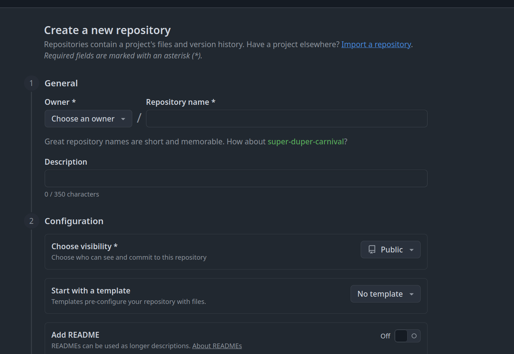

# DVC example project for Agile Data Science class

This small project shows a small use case for [DVC](https://dvc.org/)

## Create a GitHub repository

As seen on class create a new Github Repository via:



Name it `ub-agile-data-science-dvc`.

Clone the repository locally via the following command:

- note:substitute `${YOUR_USER}` for your username on GitHub (you can copy and paste the URL from GitHub)

```bash
git clone git@github.com:${YOUR_USER}/ub-agile-data-science-dvc.git
```

## Repository structure setup:

With your text editor or your IDE (Visual Studio Code for example) create a file `requirements.txt` with:

```
dvc
```

Add, commit and push the requirements.txt file to GitHub.

```bash
git add .
git commit -m "Add initial requirements.txt
git push
```

## Set up DVC

I recommend you to use a virtualenvironment, a conda environment or any other tool you use to manage your Python environments.
Example with virtualenv:

```bash
python -m venv .venv
source .venv/bin/activate
```

Install `requirements.txt`:
```bash
pip install -r requirements.txt
```

Initialize dvc:

```bash
dvc init
```

Check what the init command has done via:
```bash
git status
git diff --cached
```

Check the dvc version:
```bash
dvc version
```

Commit the init files:

```bash
git commit -m "Initialize DVC system"
```

## Add data files to DVC

Download some basic data and check the contents of the downloaded data.
The ls command will work on Unix like environments (MacOS and Linux) for Windows
check your FileSystem explorer:

```bash
dvc get https://github.com/iterative/dataset-registry \
          get-started/data.xml -o data/data.xml
ls -larth data/
```

Add the downloaded data to the tracking of dvc:

```bash
dvc add data/data.xml
```

Check what has changed locally. The data folder should appear:

```bash
git status
```

Open and check the contents of the `data/data.xml.dvc` file. You can open it on your editor (Visual Studio Code)
or with any other editor:

```bash
cat data/data.xml.dvc
```

Add the `.gitignore` and the new `data.xml.dvc` files to git, commit and push to GitHub:

```bash
git add data/.gitignore data/data.xml.dvc
git commit -m "Add initial data_xml.dvc dataset"
git push
```

## Create remote store

Create a new folder called `dvcstore` outside of the Project repository, can be anywhere on your filesystem.
I am using `/tmp` on Linux, you can use `C:/dvcstore` on Windows.

```bash
mkdir /tmp/dvcstore
```

Add the remote on dvc with:

```bash
dvc remote add -d myremote /tmp/dvcstore
```

If we would be using an AWS S3 bucket for example we would use something like:

```bash
dvc remote add -d storage s3://mybucket/dvcstore
```

Check what has changed:

```bash
git diff
```

Check differences on the directory you created:

```bash
ls /tmp/dvcstore/
```

Add the changes to git:

```bash
git add .dvc/config
git commit -m "Configuring remote for dvc"
```

## Modifying data

Edit the `data.xml` file and remove all the contents except one line:

```
  <row Id="4" PostTypeId="1" AcceptedAnswerId="7" CreationDate="2008-07-31T21:42:52.667" Score="756" ViewCount="63468" Body="&lt;p&gt;I want to use a &lt;code&gt;Track-Bar&lt;/code&gt; to change a &lt;code&gt;Form&lt;/code&gt;'s opacity.&lt;/p&gt;&#xA;&lt;p&gt;This is my code:&lt;/p&gt;&#xA;&lt;pre class=&quot;lang-cs prettyprint-override&quot;&gt;&lt;code&gt;decimal trans = trackBar1.Value / 5000;&#xA;this.Opacity = trans;&#xA;&lt;/code&gt;&lt;/pre&gt;&#xA;&lt;p&gt;When I build the application, it gives the following error:&lt;/p&gt;&#xA;&lt;blockquote&gt;&#xA;&lt;pre class=&quot;lang-none prettyprint-override&quot;&gt;&lt;code&gt;Cannot implicitly convert type decimal to double&#xA;&lt;/code&gt;&lt;/pre&gt;&#xA;&lt;/blockquote&gt;&#xA;&lt;p&gt;I have tried using &lt;code&gt;trans&lt;/code&gt; and &lt;code&gt;double&lt;/code&gt;, but then the &lt;code&gt;Control&lt;/code&gt; doesn't work. This code worked fine in a past VB.NET project.&lt;/p&gt;&#xA;" OwnerUserId="8" LastEditorUserId="3072350" LastEditorDisplayName="Rich B" LastEditDate="2021-02-26T03:31:15.027" LastActivityDate="2021-11-15T21:15:29.713" Title="How to convert a Decimal to a Double in C#?" Tags="&lt;c#&gt;&lt;floating-point&gt;&lt;type-conversion&gt;&lt;double&gt;&lt;decimal&gt;" AnswerCount="12" CommentCount="4" FavoriteCount="59" CommunityOwnedDate="2012-10-31T16:42:47.213" ContentLicense="CC BY-SA 4.0" />
```

Easy way, remove the file and copy the content above.

Check what git and dvc say about the current modifications:

```bash
git status
dvc status
```

Add the changes to the data and push the dvc changes to the repository:

```bash
dvc add data/data.xml
dvc push
```

Check the files changed on the repository. There should be two files now:

```bash
tree /tmp/dvcstore/
/tmp/dvcstore/
└── files
    └── md5
        ├── 22
        │   └── a1a2931c8370d3aeedd7183606fd7f
        └── 3a
            └── e89dda341b24491c61212f39cd09a4
```

Commit the changes to `data/data.xml.dvc`:

```
git commit data/data.xml.dvc -m "Dataset updates"
```

## Reverting the data change:

Let's go back one commit in history on the `data/data.xml.dvc` file and check the changes:
```
git checkout HEAD~1 data/data.xml.dvc
git diff --cached
```

We should see the md5 of the old file and the old file size:

Check the contents of `data/data.xml`. What happened?

Retrieve the data from the repository via:

```bash
dvc checkout
```

Check the contents of `data/data.xml`. What happened?

Commit the current changes, reverting the file to its original form:

```bash
git commit data/data.xml.dvc -m "Revert dataset updates"
```
